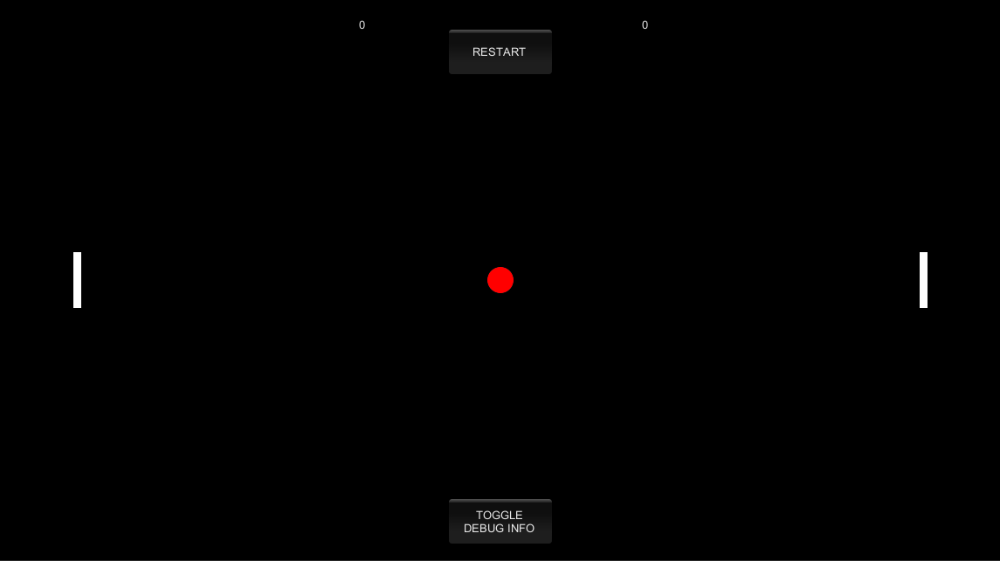

# Pong Game: The Game

This is a very basic Pong game made in Unity. It has its own rules, unlike the original game. Also the ball is a ball, not a square. And it's red.

This game is made as a study in game development, presented by Agate Academy.

## How To Run

There is no need to install the game. The build version of the game is in the build folder. All you have to do is just run the .exe file, setup your prefered resolution size, and the game runs right away it. Windowed mode is recommended to close the game easily since there's no exit button in the game.

## Features & Keybinds

- This is a 2 player game, although you can play it by yourself...
- Controls:
  - Player 1: Left Side
    - Up: W
    - Down: S
  - Player 2 : Right Side
    - Up: P
    - Down: L
- Score 5 points to win the game.
- Click the RESTART button to reset the game.
- Click the TOGGLE DEBUG INFO to see some metrics and show the ball's trajectory.

## Contributor

- Gregorius Jovan Kresnadi | 13518135
